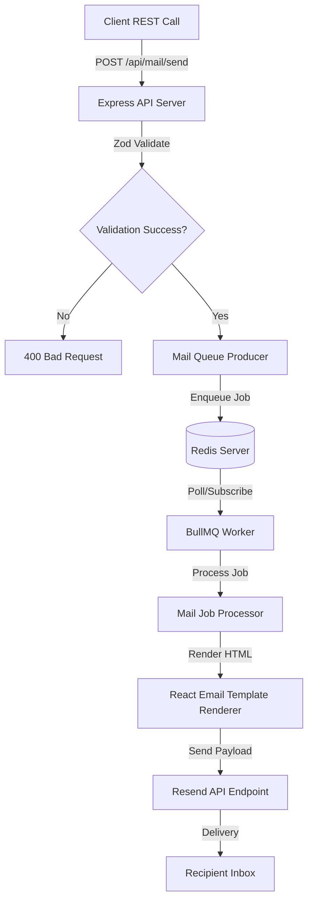

# MailFlow ✉️

An asynchronous, resilient, and production-ready email queue microservice built with **TypeScript**, **Express**, **BullMQ**, **Redis**, **React Email**, and **Resend**.

---

## Key Features

- **Queued Operations**: Offloads email sending to background worker processes via [BullMQ](https://github.com/taskforcesh/bullmq) and [Redis](https://redis.io) for high availability, rate limiting, and minimal latency.
- **Transactional Delivery**: Integrates out-of-the-box with [Resend](https://resend.com) for reliable transactional email delivery.
- **Dynamic React Templates**: Renders rich email layouts dynamically using React-based templates via `@react-email/components`.
- **Discriminated Schema Validation**: Uses [Zod](https://github.com/colinhacks/zod) to enforce compile-time and runtime type safety for incoming request payloads.
- **Resiliency & Auto-Retry**: Automatically retries failed jobs with custom exponential backoff configurations.
- **Centralized Logging & Error Handling**: Leverages [Winston](https://github.com/winstonjs/winston) for structured diagnostic logs and uses a standardized API response model with custom error classes.

---

## Directory Structure

```text
mailFlow/
├── .env                  # Environment configuration
├── package.json          # Node scripts and dependencies
├── tsconfig.json         # TypeScript compiler configurations
├── worker.ts             # Background worker process entry point
└── src/
    ├── app.ts            # Express application setup
    ├── server.ts         # HTTP Server entry point
    ├── config/           # Config modules (environment, Redis, Resend)
    │   ├── env.config.ts
    │   ├── redis.config.ts
    │   └── resend.config.ts
    ├── infrastructure/   # Infrastructure layer (connectors, API clients)
    │   ├── cache/
    │   │   └── redis.client.ts
    │   ├── providers/
    │   │   └── resend.provider.ts
    │   └── queues/
    │       └── mail.queue.ts
    ├── jobs/             # BullMQ task queues and workers
    │   ├── processors/
    │   │   └── mail.processor.ts
    │   └── workers/
    │       └── mail.worker.ts
    ├── modules/          # Core Business Domains
    │   └── mail/         # Mail domain files
    │       ├── constants/
    │       ├── controller/
    │       ├── interfaces/
    │       ├── producers/
    │       ├── routes/
    │       ├── services/
    │       ├── templates/ # React Email layouts (WelcomeEmail, OTPEmail)
    │       └── validations/
    └── shared/           # Common utilities and cross-cutting concerns
        ├── exceptions/   # Custom Error definitions (AppError)
        ├── logger/       # Winston Logger instances
        ├── middleware/   # Request and Error handlers
        ├── responses/    # Consistent API response helpers
        └── utils/        # General utilities (asyncHandler wrapper)
```

---

## Technical Architecture

The service uses a **Producer-Consumer** architecture:



---

## Getting Started

### Prerequisites

Make sure you have the following installed on your local machine:
- **NodeJS** (v18.x or above)
- **Redis Server** (listening on localhost/default port `6379`, or a cloud connection string)

### Installation

1. Clone the repository and navigate to the directory:
   ```bash
   cd mailFlow
   ```
2. Install npm dependencies:
   ```bash
   npm install
   ```

### Configuration Setup

Create a `.env` file in the root folder of the project. A template of the environment variables is shown below:

```env
PORT=3000
REDIS_HOST=127.0.0.1
REDIS_PORT=6379
RESEND_API_KEY=your_resend_api_key_here
MAIL_FROM=your_sender_email@yourdomain.com
```

---

## Run Operations

To run the application, you need to spin up the API web server and at least one worker process.

### Running in Development

- **Start HTTP server:**
  ```bash
  npm run dev
  ```
  Runs the server on `http://localhost:3000` with hot-reloading via `tsx` and `nodemon`.

- **Start Queue Worker:**
  ```bash
  npm run worker
  ```
  Launches the worker CLI which registers listeners on Redis and executes email dispatches asynchronously.

### Running in Production

1. Compile the TypeScript files:
   ```bash
   npm run build
   ```
2. Start the compiled server:
   ```bash
   npm run start
   ```

---

## API Reference

### 1. Health Status
Check if the Express app is running and responsive.

* **URL:** `/health`
* **Method:** `GET`
* **Success Response:**
  * **Code:** `200 OK`
  * **Content:**
    ```json
    {
      "status": "ok"
    }
    ```

### 2. Send Mail
Validate, enqueue, and schedule an email to be sent asynchronously.

* **URL:** `/api/mail/send`
* **Method:** `POST`
* **Headers:** `Content-Type: application/json`
* **Request Payloads:** (Validated via Zod's discriminated union depending on the `type` field)

#### Option A: Welcome Email (`type: "welcome"`)
```json
{
  "to": "recipient@example.com",
  "type": "welcome",
  "name": "Alex Mercer"
}
```

#### Option B: One-Time Password / Verification (`type: "otp"`)
```json
{
  "to": "recipient@example.com",
  "type": "otp",
  "otp": "993821",
  "expiresIn": "15 minutes"
}
```

#### Responses:

* **Success Response (Enqueued Successfully):**
  * **Code:** `202 Accepted`
  * **Content:**
    ```json
    {
      "success": true,
      "data": {
        "message": "Mail queued successfully"
      }
    }
    ```

* **Error Response (Validation Failed):**
  * **Code:** `400 Bad Request`
  * **Content:**
    ```json
    {
      "success": false,
      "message": "[Zod validation detailed error messages]"
    }
    ```

---

## Queue Configuration Details

The background queue relies on BullMQ and includes several default features optimized for resilience:

- **Concurrency**: Set to `5` parallel jobs per worker instance.
- **Max Retries**: Failed attempts are retried up to `3` times before moving to the failed state.
- **Backoff Strategy**: Exponential backoff with an initial delay of `5000 milliseconds` (5 seconds).
- **Auto Cleanup**: Completed and failed jobs are automatically pruned from Redis stores to conserve memory space.
